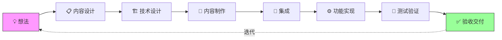

## 系统开发工作流

大部分游戏会包含很多基于UI交互的系统玩法，开发这个系统是要经过多个工种、使用不同工具、按照一定的流程完成的。系统开发工作流定义了从想法到验收的完整流程，确保各角色高效协作，产出高质量的游戏系统。

**关键词:** 
*MVC,集成,测试,工作流,内容设计,技术设计,功能实现*

**标签:** 
*等级: 中级, 阶段: 开发, 分类: 管理能力, 角色: 管理|客户端开发|服务端开发|策划|测试*

## 图谱

## 目录

- [工作流概览](#工作流概览)
- [想法与需求](#想法与需求)
- [内容设计](#内容设计)
- [技术设计](#技术设计)
- [内容制作](#内容制作)
- [内容集成](#内容集成)
- [功能实现](#功能实现)
- [集成测试](#集成测试)
- [验收](#验收)
- [更多资料](#更多资料)

----

## 工作流全景图

> 8 阶段从想法到交付，形成持续迭代闭环。每个阶段有明确的交付物和角色分工。

## 工作流概览

## 想法与需求

| 维度 | 内容 |
|------|------|
| **作用** | 系统开发的起始阶段，明确系统的价值和目标 |
| **应用场景** | 新系统开发初期；需求分析；目标明确 |
| **做什么的？** | 系统开发的起始阶段，明确系统的价值和目标 |
| **在哪用？** | 所有新系统开发的初期阶段 |

| 问题 | 解决方向 |
|------|----------|
| **如何让相关开发人员理解系统的价值和目标？** | 明确系统价值和目标，清晰传达给开发人员；明确系统体验和感受，清晰传达给开发人员；进行头脑风暴；编写需求文档；组织需求评审 |
| **如何传达系统的体验和感受？** | 使用原型演示；使用参考案例；使用体验描述；组织体验评审 |
| **如何避免过度细化任务，保持灵活性？** | 交给开发团队的是虚的内容（目标、体验等），而非具体切割好的任务或功能，让开发团队有更多发挥空间；提供目标和体验；避免过度细化任务；保持开发灵活性以应对需求变化 |

| 要点和思考方向 |
|----------------|
| 想法与需求是系统开发的起点 |
| 如果有新系统的需要，可以先做个头脑风暴 |
| 给相关开发人员能讲清楚价值和目标、体验和感受 |
| 如果是跟游戏内容相关的东西，交给开发团队的最好是虚的内容（目标、体验等），而不是具体切割好的任务或功能 |

## 内容设计

| 维度 | 内容 |
|------|------|
| **作用** | 策划设计系统功能、UI布局、操作流程和配置数据 |
| **应用场景** | 系统开发的策划设计阶段；功能设计；UI设计；数据设计 |
| **做什么的？** | 策划设计系统功能、UI布局、操作流程和配置数据 |
| **在哪用？** | 系统开发的策划设计阶段 |

| 问题 | 解决方向 |
|------|----------|
| **如何清晰地表达系统功能？** | 编写系统功能说明，明确文档读者（程序、QA），清晰描述系统功能、交互逻辑、边界条件；使用图表辅助说明；组织功能评审 |
| **如何设计UI布局和操作流程？** | Layout（图）设计：策划直接在游戏引擎中搭建UI布局、放置UI部件（使用占位图），可能需要程序协助；若不能使用引擎，则在原型工具中制作Layout，由程序完成初始搭建 流程（图）设计：设计操作流程、使用流程图，明确文档读者（程序、QA） 组织UI评审 |
| **如何设计数据驱动的配置？** | 设计配置表结构，实现数据驱动开发；优化配置管理 |
| **如何确保各方理解一致？** | 策划与程序、美术充分沟通，组织设计评审；进行技术沟通和美术沟通，确保各方理解一致 |

| 要点和思考方向 |
|----------------|
| 内容设计是系统开发的基础 |
| 清晰表达系统功能、UI布局和操作流程 |
| 设计数据驱动的配置 |
| 确保各方理解一致 |

## 技术设计

| 维度 | 内容 |
|------|------|
| **作用** | 程序进行技术方案设计，明确实现路径 |
| **应用场景** | 系统开发的技术设计阶段；技术方案设计；架构设计 |
| **做什么的？** | 程序进行技术方案设计，明确实现路径 |
| **在哪用？** | 系统开发的技术设计阶段 |

| 问题 | 解决方向 |
|------|----------|
| **如何设计技术架构？** | 编写TDD文档（技术设计文档），包含：相关的类及职责、关键流程及步骤、关键技术选型及方案 |
| **如何平衡设计文档的详细程度？** | 写关键问题即可，避免事无巨细浪费时间和失去焦点；重点关注架构设计、关键技术难点、接口设计等核心内容 |

| 要点和思考方向 |
|----------------|
| 技术设计是系统实现的基础 |
| 设计合理的技术架构 |
| 写关键问题，避免事无巨细 |
| 重点关注架构设计、关键技术难点、接口设计等核心内容 |

## 内容制作

| 维度 | 内容 |
|------|------|
| **作用** | 美术、程序、策划协作制作系统所需的各种内容 |
| **应用场景** | 系统开发的内容制作阶段；UI制作；动画制作；音效制作 |
| **做什么的？** | 美术、程序、策划协作制作系统所需的各种内容 |
| **在哪用？** | 系统开发的内容制作阶段 |

| 问题 | 解决方向 |
|------|----------|
| **如何协调UI、动画、音效的制作？** | UI制作-美术：基于前期UI主题设计素材搭建新页面，制作美术资源并确保规格符合 UI制作-动画：设计页面切换和部件动态效果，制作动画资源并确保规格符合 UI制作-音效：设计音效配合动画效果，制作音效资源并确保规格符合 UI制作-程序：在引擎中设置对象属性和参数；若策划不能搭建Layout，程序根据策划Layout搭建所有对象 协调制作进度，确保规格一致，组织制作评审 |
| **如何处理外包内容制作？** | 让第三方（外包）团队制作具体内容（图标、角色、原画、音效等）；编写详细需求说明：图标需明确命名、格式、规格、风格，动画需明确工具、版本、动作描述；管理外包流程，验收外包内容 |
| **如何确保内容规格符合要求？** | 制作系统中所需的配表（元数据），确保数据正确；建立规格标准；实现规格检查；组织规格评审 |

| 要点和思考方向 |
|----------------|
| 内容制作需要多角色协作 |
| 协调UI、动画、音效的制作进度 |
| 处理外包内容制作需要详细的需求说明 |
| 确保内容规格符合要求 |

## 内容集成

| 维度 | 内容 |
|------|------|
| **作用** | 将制作好的内容资源集成到游戏工程中 |
| **应用场景** | 内容制作完成后的集成阶段；资源集成；工程配置 |
| **做什么的？** | 将制作好的内容资源集成到游戏工程中 |
| **在哪用？** | 内容制作完成后的集成阶段 |

| 问题 | 解决方向 |
|------|----------|
| **如何确保资源正确放置和命名？** | 人工集成：把资源放到正确目录、使用正确命名；更新UI对象的图素；每个团队协商好由谁负责；建立资源和命名规范，实现资源检查，明确责任分配 |
| **如何提高集成效率？** | 开发自动化辅助功能，实现自动（或一键）将资源集成到游戏工程中，提高效率、减少人为错误 |

| 要点和思考方向 |
|----------------|
| 内容集成是资源进入工程的关键步骤 |
| 确保资源正确放置和命名 |
| 实现自动化集成提高效率 |
| 减少人为错误 |

## 功能实现

| 维度 | 内容 |
|------|------|
| **作用** | 程序实现系统的功能逻辑和表现 |
| **应用场景** | 系统开发的核心实现阶段；功能开发；逻辑实现；表现实现 |
| **做什么的？** | 程序实现系统的功能逻辑和表现 |
| **在哪用？** | 系统开发的核心实现阶段 |

| 问题 | 解决方向 |
|------|----------|
| **如何组织代码结构？** | 推荐先写框架（类、方法及注释），再实现内容，有助于对系统宏观把握；设计代码结构，实现框架代码，逐步实现功能 |
| **如何实现View、Controller、Model的分离？** | 推荐使用MVC框架：View层负责UI对象组织、确定动态表现、实现UI逻辑；Controller层负责与后端约定接口、设计前端接口、实现业务逻辑；Model层负责元数据/配表数据、各对象数据的管理 |
| **如何处理表现和逻辑的对接？** | View（表现）开发：内容集成、动态效果实现（过渡/显示/隐藏/操作动画）、表现内容与数据的对接、表现内容与业务逻辑的对接 Controller（逻辑）开发：管理数据显示与刷新、处理系统间交互与响应 设计表现逻辑接口，优化对接性能 |

| 要点和思考方向 |
|----------------|
| 功能实现是系统开发的核心 |
| 先写框架再实现内容有助于宏观把握 |
| 使用MVC框架实现代码分离 |
| 处理好表现和逻辑的对接 |

## 集成测试

| 维度 | 内容 |
|------|------|
| **作用** | 测试系统功能的正确性和完整性 |
| **应用场景** | 功能实现完成后的测试阶段；功能测试；集成测试；质量保证 |
| **做什么的？** | 测试系统功能的正确性和完整性 |
| **在哪用？** | 功能实现完成后的测试阶段 |

| 问题 | 解决方向 |
|------|----------|
| **如何确保测试覆盖全面？** | QA进行更全面的测试，包括功能测试、边界测试、兼容性测试等；设计测试用例，实现测试覆盖，优化测试质量 |
| **如何提高测试效率？** | 开发团队优先自测功能，确保基本功能正常后再交给QA，减少无效测试；实现自测机制，优化测试流程 |

| 要点和思考方向 |
|----------------|
| 集成测试是质量保证的重要环节 |
| 开发团队优先自测功能，然后交给QA |
| QA进行更全面的测试 |
| 提高测试效率和质量 |

## 验收

| 维度 | 内容 |
|------|------|
| **作用** | 最终验收系统是否符合预期 |
| **应用场景** | 测试完成后的验收阶段；功能验收；体验验收；质量验收 |
| **做什么的？** | 最终验收系统是否符合预期 |
| **在哪用？** | 测试完成后的验收阶段 |

| 问题 | 解决方向 |
|------|----------|
| **如何判断系统是否符合预期？** | Product Owner（制作人/策划）从产品角度验收功能体验，检查是否符合设计预期、体验是否良好；建立验收标准，进行体验验收和功能验收 |
| **如何处理验收中的问题？** | 验收中发现的问题反馈给开发团队，进行迭代优化，持续打磨系统；建立问题反馈机制，实现迭代优化 |

| 要点和思考方向 |
|----------------|
| 验收是系统开发的最后环节 |
| Product Owner验收功能的体验 |
| 如果有问题，反馈给团队继续打磨 |
| 持续迭代优化系统 |

## 更多资料
